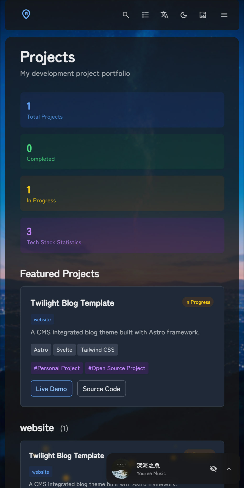

<div align = "center">

# Twilight

A CMS integrated static blog template built with Astro framework.

[**🖥️ Live Demo**](https://twilight.spr-aachen.com)
[**📝 Documentation**](https://docs.twilight.spr-aachen.com/en)

[](https://space.bilibili.com/359461611/lists/6641229)&nbsp;
[](https://youtube.com/playlist?list=PLzjq8Hx1SRV7yqZQiACcCJmKPeg5D8JKe&si=Bcz2o0PF8MFvx8ec)

<table style="width: 100%; table-layout: fixed;">
   <tr>
      <td colspan="5"></td>
   </tr>
   <tr>
      <td></td>
      <td></td>
      <td></td>
      <td></td>
      <td></td>
   </tr>
</table>

</div>

---

<div align = "center">

English | [**中文**](docs/README_ZH.md)

</div>


## ✨ Features

### Content
- **CMS Functionality**: Easy content management with headless CMS integration
- **Data Visualization**: Visualized personal data like projects, skills etc.
- **Automatic Navigation**: Automatic generation of post navigation

### Components
- **Analytics Support**: Umami analytics integration for visitor insights
- **Comment System**: Twikoo-powered comment functionality
- **Music Player**: Background music support with playlist management
- **PIO Widget**: Interactive live2d character support

### VFX
- **Smooth Transition Animations**: Polished page component transition animations
- **Customizable Theme Colors**: Realtime customizable color schemes
- **Dynamic Wallpaper System**: Carousel support with multiple display modes
- **Immersive Particle Effects**: Highly customizable animated particles

### Compability
- **Modern & Responsive Design**: Fully optimized for desktop and mobile devices
- **Multilingual Capability**: Built-in translation functionality for global accessibility


## 💻 Configuration

1. **Clone the repository:**
   ```bash
   git clone https://github.com/Spr-Aachen/Twilight.git
   # Navigate to the project directory
   cd Twilight
   ```

2. **Install dependencies:**
   ```bash
   # Install pnpm if not already installed
   npm install -g pnpm
   # Install project dependencies
   pnpm install
   ```

3. **Configure your blog:**
   - [Customize blog settings](https://docs.twilight.spr-aachen.com/en/config/core) inside `twilight.config.yaml`
   - [Manage site content](https://docs.twilight.spr-aachen.com/en/config/content) inside `src/content`

4. **Start the development server:**
   ```bash
   pnpm dev
   ```


## 🚀 Deployment

Deploy your blog to any static hosting platform


## ⚡ Commands

| Command                     | Action                        |
|:----------------------------|:------------------------------|
| ~~`pnpm lint`~~             | ~~Check and fix code issues~~ |
| ~~`pnpm format`~~           | ~~Format code with Biome~~    |
| `pnpm check`                | Run Astro error checking      |
| `pnpm dev`                  | Start local dev server        |
| `pnpm build`                | Build site to `./dist/`       |
| `pnpm preview`              | Preview build locally         |
| `pnpm astro ...`            | Run Astro CLI commands        |
| `pnpm new-post <filename>`  | Create a new blog post        |


## 🙏 Acknowledgements

- Prototype   - [Fuwari](https://github.com/saicaca/fuwari)
- Inspiration - [Yukina](https://github.com/WhitePaper233/yukina) & [Mizuki](https://github.com/matsuzaka-yuki/Mizuki)
- Translation - [translate](https://gitee.com/mail_osc/translate)