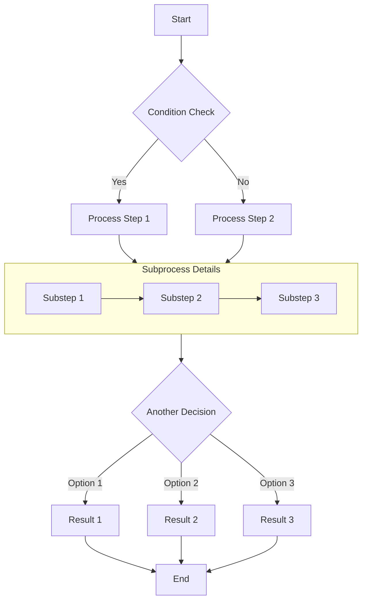
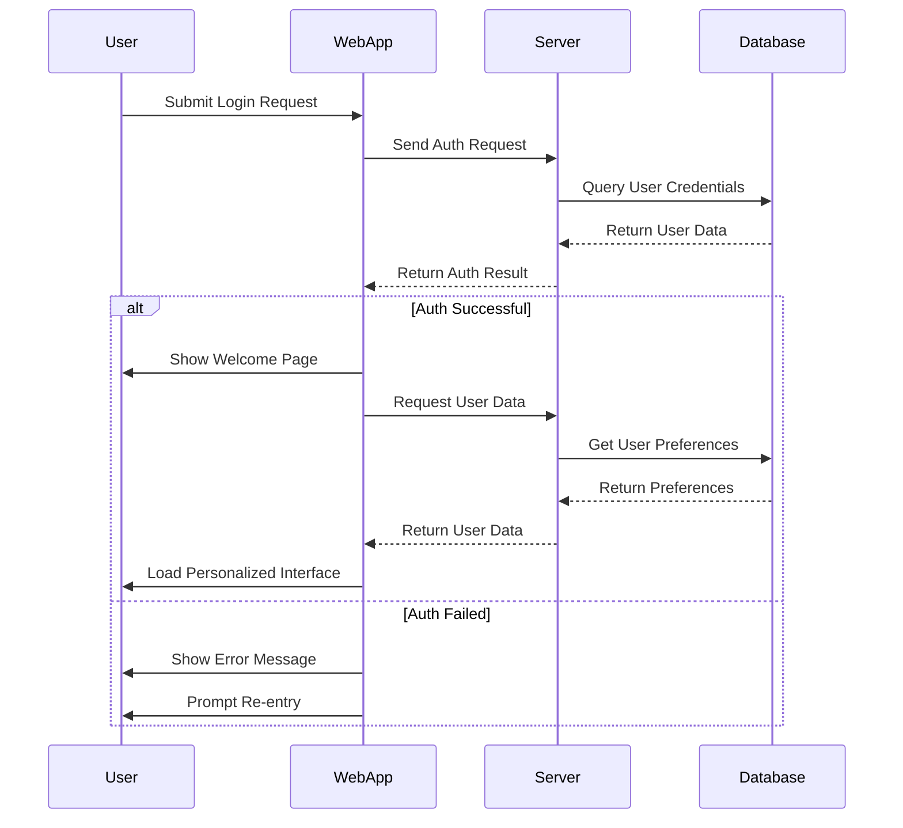
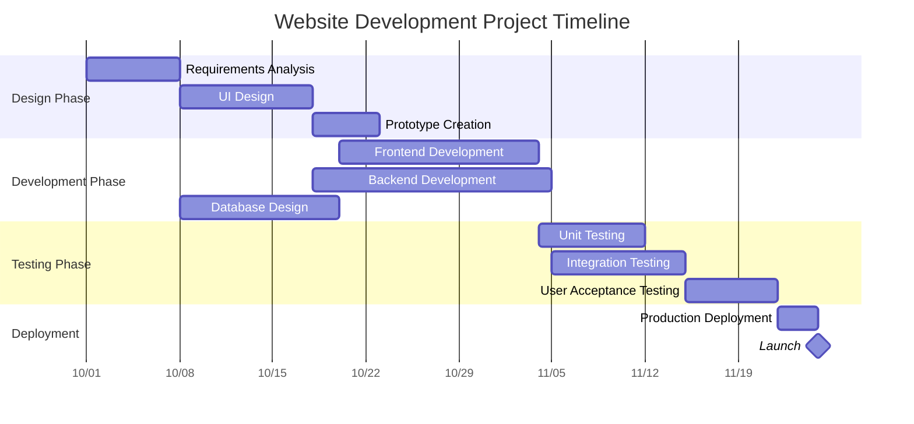
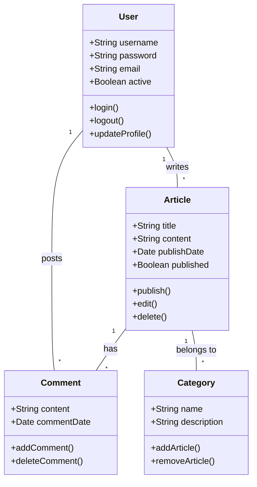
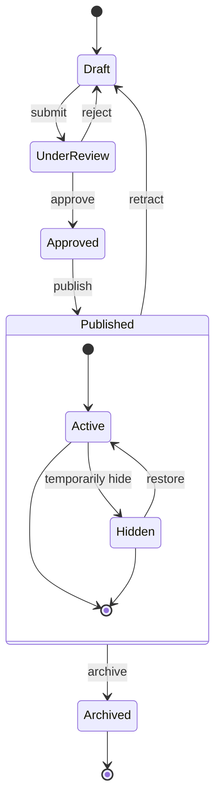
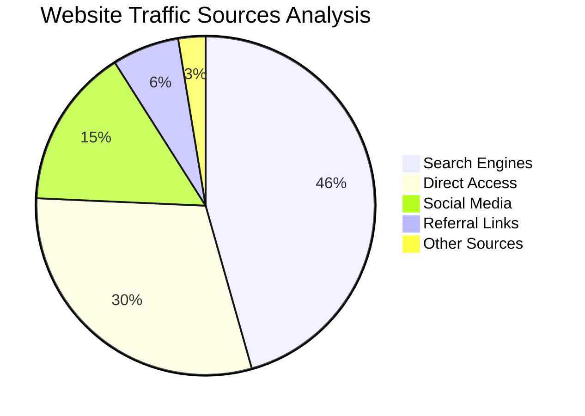

# 1.0 过去使用的博客架构

## 1.1 Jekyll

Jekyll软件介绍：[http://www.noobyard.com/article/p-nwnqarhl-gs.html](http://www.noobyard.com/article/p-nwnqarhl-gs.html)  
Jekyll托管到GitHub：[https://www.cnblogs.com/Eaglery/p/5126279.html](https://www.cnblogs.com/Eaglery/p/5126279.html)

```yaml
#官方教程：https://jekyllrb.com/docs/installation/windows/ 
ridk install #msys2_install
gem install jekyll bundler
gem update jekyll #升级
gem sources -r https://rubygems.org/
gem sources --add https://mirrors.tuna.tsinghua.edu.cn/rubygems/
gem sources -l

jekyll new XXX #建立一个新的Jekyll站点，创建指令需要管理员下的CMD，不然各种错误
cd XXX #进入刚才创建的目录
bundle install #安装Gefile内需要组件
bundle update
bundle exec jekyll serve 
#（开始构建本地网址）（如果发现4000被占用，参考(https://blog.csdn.net/weixin_30666401/article/details/98372840)） https://blog.csdn.net/oneby1314/article/details/113710763

netstat -ano|findstr "4000"
taskkill -F -PID 5632 #一般都是福昕阅读器占用

#（主题下载网址：https://rubygems.org/search?query=jekyll-theme）
#（参考使用方法：将github上的文件全部下载覆盖自己的blog文件夹，之后再次bundle install）
```

写Blog注意文件的格式必须为YEAR-MONTH-DAY-title.MARKUP，如：2019-02-13-blog.md

为了后续编辑方便，这边推荐复制一下你Blog文件夹，以后你编辑内容时使用非上传文件夹（旧文件夹）。需要上传时复制一下整体，在新文件夹里把site文件夹里的文件全部拷贝到新文件夹里，上传步骤中上传新文件夹就不会出现Blog合集无法显示的问题了。

下面内容为git相关

```yaml
git init
git checkout -b main
git add .
git commit -m "XX" #以XX名字上传github
git remote add origin https://github.com/LLGY0/LLGY0.github.io.git
git push origin main #正式开始上传

#这一部分实战不需要，放在这是为了参考
git checkout source
jekyll build
git add -A
git commit -m "update source"
cp -r _site/ /tmp/
git checkout master
rm -r ./*
cp -r /tmp/_site/* ./
git add -A
git commit -m "deploy blog"
git push origin master
git checkout source
echo "deploy succeed"
git push origin source
echo "push source"
```

### 1.1.1 注意事项

```yaml
1、注意git的时候千万不能用`gh-pages`（不然在github生成网站时会出错，错误提示：`Action failed with "You deploy from gh-pages to gh-pages；This operation is prohibited to protect your contents`）

2、命名github的`repository`时，命名直接用`用户名+.github.io`，这样设置用户文件夹里的`_config.yml`时，就不用改`baseurl`了。（如果改baseurl，很容易导致输入代码-jekyll serve时出错，出错代码：`sw not found`）

3、[关于`_config.yml`中`baseurl`的介绍](https://blog.csdn.net/pxyyoona/article/details/123150326)

4、上传时出现`The requested URL returned error: 403`的解决方法
[链接1](https://blog.csdn.net/weixin_45844049/article/details/123733065)
[链接2](https://blog.csdn.net/qq_40226073/article/details/119801341)

5、.gitignore文件有可能将_site文件添加为忽略文件，以至于后续操作将该文件忽略，从而无法上传至远程仓库的问题。_site文件以及.sass-cache文件都不能被忽略。另一方面，site里面的文件内容需要上传到github来使重要元件显现。
[链接1](https://blog.csdn.net/qq_43328313/article/details/124066785)
[链接2](https://blog.csdn.net/qq_56914146/article/details/128994392)
```

### 1.1.2 参考代码

```yaml
 #插入图片

`XXXXX` #高亮文字

#```markdown #插入代码
#```
- X #插入圆点

<iframe id="video" src="https://www.bilibili.com/video/BV1qs41157ZZ" width="100%" frameborder="0" allowfullscreen="allowfullscreen" sandbox=""></iframe>
<script type="text/javascript">document.getElementById("video").style.height=document.getElementById("video").scr #插入视频

**A** #加粗

$$
\forall \alpha \in A, \quad a \cdot b = 0
$$   #公式

$$
\begin{align}
    \Phi(0,x) = \max_{u \in \mathcal{D}} \bigg[
        \mathbb{E} & \Phi\left(1, 
        x + \int_0^1 \sigma^2(s) \, \zeta(s) \, u_s \, ds
        + \int_0^1 \sigma(s) \, dW_s
    \right) \\
        &- \frac{1}{2} \int_0^1 \sigma^2(s) \, \zeta(s) \,
        \mathbb{E} u_s^2  \, ds
    \bigg].
\end{align} 
$$  #align的公式

graph TD;
    A-->B;
    A-->C;
    B-->D;
    C-->D; #Mermaid画，需要加入```mermaid


gantt
    title A Gantt Diagram
    dateFormat x
    axisFormat %L
    section Section
    A task           :a1, 0, 30ms
    Another task     :after a1, 20ms
    section Another
    Another another task      :b1, 20, 12ms
    Another another another task     :after b1, 24ms #同上

[pdf名字](https://用户名.github.io/....pdf) #插入pdf
```

### 1.1.3 插件

```yaml
emoji代码： 
https://www.webfx.com/tools/emoji-cheat-sheet/
网易云音乐插件 在每个页面抬头添加music-id: XXXX
为Jekyll博客添加目录与ScrollSpy效果：
http://t.hengwei.me/post/%E4%B8%BAjekyll%E5%8D%9A%E5%AE%A2%E6%B7%BB%E5%8A%A0%E7%9B%AE%E5%BD%95%E4%B8%8Escrollspy%E6%95%88%E6%9E%9C.html
个人博客中添加点击爱心效果：
https://yizibi.github.io/2018/10/18/%E4%B8%AA%E4%BA%BA%E5%8D%9A%E5%AE%A2%E4%B8%AD%E6%B7%BB%E5%8A%A0%E7%82%B9%E5%87%BB%E7%88%B1%E5%BF%83%E6%95%88%E6%9E%9C/
https://blog.51cto.com/u_15127588/2807647
添加阅读量统计功能：
https://blog.csdn.net/qq_32507255/article/details/89068958?ops_request_misc=&request_id=&biz_id=102&utm_term=jekyll%20%E7%82%B9%E5%87%BB&utm_medium=distribute.pc_search_result.none-task-blog-2~blog~sobaiduweb~default-4-89068958.268^v1^koosearch&spm=1018.2226.3001.4450
gitalk：
https://www.pianshen.com/article/4404354477/  
https://blog.csdn.net/zy13651953784/article/details/104813021  
https://blog.csdn.net/sinat_32873711/article/details/129192910  
https://github.com/gitalk/gitalk/blob/master/readme-cn.md  
https://gitalk.github.io/  
https://github.com/gitalk/gitalk#install
随机BGM与全局BGM：
https://www.jianshu.com/p/b2306e9b7ba7   
https://szhshp.org/tech/2016/11/19/whynotaddabgmforurblog.html
添加站点访客数及文章浏览量、添加中英文字数统计：
https://blog.csdn.net/ds19991999/article/details/81293467
Live2D小人：
https://github.com/stevenjoezhang/live2d-widget
```

## 1.2 Hexo与Hugo

```yaml
hugo new site 站点名
hugo server -D
```

# 2.0 Astro架构

## 2.1 构建代码

```yaml
npm config get registry # 查看当前源
npm config set registry https://registry.npmmirror.com # 切换到国内镜像（npmmirror）
npm config set registry https://registry.npmjs.org #切回官方源
npm cache clean --force #清理换源缓存

npm install astro@latest #原生astro安装 npm install
npx astro telemetry disable #Astro is no longer collecting anonymous usage data.

git clone https://github.com/Spr-Aachen/Twilight.git #克隆 Twilight 项目到本地
cd Twilight #进入文件夹，可提前改名
npm install -g pnpm #安装 pnpm
pnpm install #安装项目依赖

pnpm dev #启动， http://localhost:4321
pnpm build #将网站打包成静态文件，生成到 dist 目录中
pnpm new-post <filename> #生成新post

#部署到github上：修改twilight.config.yaml里的siteURL，格式为“https://<你的GitHub用户名>.github.io”
git init
git add .
git branch -M main
git commit -m "标号"
git remote add origin https://github.com/<用户名>/<仓库名>.git
git remote add origin https://github.com/LLGY0/llgy0.github.io
git push -u origin main
```

[https://llgy0.github.io](https://llgy0.github.io)

## 2.2 代码格式参考

### 2.2.1 表格


| Attribute | Description |
| --------- | ----------- |
| `XX` | XX |
| `XX` | XX |


### 2.2.2 加密方式

```yaml
---
title: Encryption Example
published: 2020-02-02
encrypted: true
password: "your-password"
---
```

### 2.2.3 Flowchart Example



### 2.2.4 Sequence Diagram Example



### 2.2.5 Gantt Chart Example



### 2.2.6 Class Diagram Example



### 2.2.7 State Diagram Example



### 2.2.8 Pie Chart Example



### 2.2.9 引入视频链接

```
<iframe width="100%" height="468" src="//player.bilibili.com/player.html?bvid=BV14QpMeSEuD&p=1&autoplay=0" scrolling="no" border="0" frameborder="no" framespacing="0" allowfullscreen="true" &autoplay=0> </iframe>
```

### 2.2.10 引入音乐链接

```
::music{meting="[https://meting.spr-aachen.com/api?server=netease&type=song&id=1390882521](https://meting.spr-aachen.com/api?server=netease&type=song&id=1390882521)"}
```

